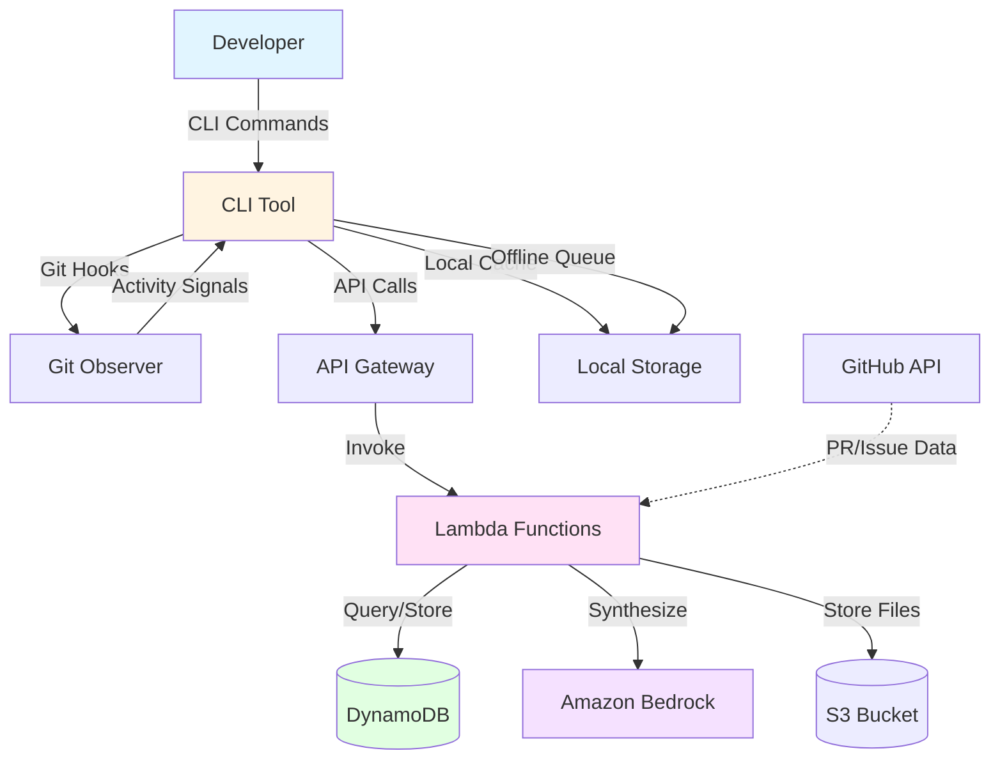

# Design Document: ContextAnchor

## Overview

ContextAnchor is a developer workflow state management system that eliminates context-switching overhead by combining passive git activity monitoring with explicit intent capture. The system creates high-fidelity snapshots of developer mental state and automatically restores them when returning to work.

### Core Value Proposition

Developers lose significant time when switching between tasks or returning to projects after interruptions. ContextAnchor addresses this by:

1. **Passive Observation**: Monitoring git operations (commits, branches, diffs) to understand actual work patterns
2. **Intent Capture**: Prompting developers to articulate their current mental state before switching tasks
3. **AI Synthesis**: Using Amazon Bedrock to transform raw signals into structured context snapshots
4. **Automatic Restoration**: Surfacing saved context when developers return to branches or projects

### Design Principles

- **Minimal Friction**: Commands complete in under 2 seconds; no blocking of git operations
- **Privacy First**: No source code transmitted; only metadata and developer-provided text
- **Offline Resilient**: Core functionality works without network connectivity
- **Cost Conscious**: AWS serverless architecture designed to stay within Free Tier limits
- **Developer Control**: Explicit opt-in per repository; clear data ownership

### System Boundaries

**In Scope:**
- Git activity monitoring (commits, branches, diffs, PR/issue references)
- CLI-based context capture and restoration
- AI-powered context synthesis using Amazon Bedrock
- Persistent storage in DynamoDB
- GitHub integration for PR/issue metadata
- Multi-repository support
- Offline operation with sync queue

**Out of Scope:**
- IDE integrations (future enhancement)
- Real-time collaboration features
- Code review or diff analysis
- Project management integration beyond GitHub
- Custom AI model training

## Architecture

### High-Level Architecture



### Component Architecture

The system consists of three primary layers:

1. **Client Layer** (Developer Machine)
   - CLI Tool: Command interface and orchestration
   - Git Observer: Hook-based activity monitoring
   - Local Storage: Offline cache and operation queue

2. **API Layer** (AWS Cloud)
   - API Gateway: HTTP endpoint management
   - Lambda Functions: Serverless compute for business logic
   - Authentication: Developer identity and authorization

3. **Data Layer** (AWS Cloud)
   - DynamoDB: Context snapshot persistence
   - S3: Optional file storage for large payloads
   - Bedrock: AI synthesis engine

### Data Flow Patterns

**Context Capture Flow:**
```
Developer → save-context command → CLI Tool
  → Collect git signals (uncommitted changes, recent commits)
  → Prompt "What were you trying to solve right now?"
  → Developer provides intent
  → Send to API Gateway
  → Lambda invokes Bedrock for synthesis
  → Store Context_Snapshot in DynamoDB
  → Return snapshot_id to CLI
  → Display confirmation
```

**Context Restoration Flow:**
```
Developer → Branch switch (git checkout)
  → Git post-checkout hook triggers
  → CLI Tool detects branch change
  → Query API Gateway for latest snapshot
  → Lambda retrieves from DynamoDB
  → Return Context_Snapshot
  → CLI displays: Goals, Rationale, Open Questions, Next Steps
  → Include links to relevant files, PRs, and issues
```

**Offline Operation Flow:**
```
Developer → save-context command → CLI Tool
  → Detect network unavailable
  → Store raw signals in local queue
  → Display "Saved locally, will sync when online"
  → Background process monitors connectivity
  → When online: replay queued operations
  → Use exponential backoff for retries
  → Stop after 24 hours with recovery message
```

### Technology Stack

**Client Side:**
- Language: Python 3.11+ (cross-platform compatibility)
- CLI Framework: Click or Typer (rich terminal UI support)
- Git Integration: GitPython library
- Local Storage: SQLite for offline queue and cache
- Configuration: YAML or TOML for user preferences

**AWS Services:**
- **API Gateway**: REST API with regional endpoint
- **Lambda**: Python 3.11 runtime, 512MB memory, 30s timeout
- **DynamoDB**: On-demand billing mode for cost efficiency
- **Bedrock**: Claude 3 Haiku model (cost-effective, fast)
- **S3**: Standard storage with lifecycle policies
- **CloudWatch**: Logs and metrics
- **IAM**: Fine-grained access control

**Infrastructure as Code:**
- AWS CDK (Python) for deployment automation
- CloudFormation for resource provisioning
- Cost guardrails via AWS Budgets

## Components and Interfaces

### CLI Tool Component

**Responsibilities:**
- Command parsing and validation
- Git repository detection and validation
- Git activity signal collection
- User prompt interaction
- API communication with retry logic
- Local caching and offline queue management
- Context display formatting

**Key Interfaces:**

```python
class CLITool:
    def save_context(self, repository_path: str) -> ContextSnapshot:
        """Capture current developer mental state"""
        
    def show_context(self, repository_path: str, branch: str = None, 
                     timestamp: datetime = None) -> ContextSnapshot:
        """Display saved context for current or specified branch"""
        
    def list_contexts(self, repository_path: str, limit: int = 20) -> List[ContextSnapshot]:
        """List all saved contexts for current repository"""
        
    def history(self, repository_path: str, branch: str = None,
                limit: int = 20, next_token: str = None) -> SnapshotList:
        """List historical snapshots for the current or specified branch"""

    def delete_context(self, snapshot_id: str) -> bool:
        """Immediately remove a snapshot from active views and schedule irreversible purge"""
        
    def init_repository(self, repository_path: str) -> InitResult:
        """Enable ContextAnchor monitoring for repository"""
        
    def export_metrics(self, format: str = "json") -> str:
        """Export usage and productivity metrics"""
```

**Configuration:**
```yaml
# ~/.contextanchor/config.yaml
api:
  endpoint: https://api.contextanchor.example.com
  timeout_seconds: 30
  retry_attempts: 3

capture:
  prompt: "What were you trying to solve right now?"
  auto_include_uncommitted: true
  
storage:
  retention_days: 90
  offline_queue_max: 200
  
monitoring:
  enabled_signals:
    - commits
    - branches
    - diffs
    - pr_references
    
privacy:
  redact_patterns:
    - "(?i)(api[_-]?key|token|secret|password)\\s*[:=]\\s*['\"]?([^'\"\\s]+)"
```

### Git Observer Component

**Responsibilities:**
- Install and manage git hooks (post-commit, post-checkout)
- Extract git activity signals (commits, branches, diffs)
- Parse PR and issue references from commit messages
- Detect GitHub remotes and extract repository metadata
- Provide fallback detection when hooks unavailable
- Capture diff metadata through explicit observation entry points and guaranteed save-context fallback capture

**Key Interfaces:**

```python
class GitObserver:
    def install_hooks(self, repository_path: str) -> HookInstallResult:
        """Install git hooks for automatic monitoring"""
        
    def capture_commit_signal(self, repository_path: str) -> CommitSignal:
        """Extract signal from most recent commit"""
        
    def capture_branch_switch(self, repository_path: str, 
                             from_branch: str, to_branch: str) -> BranchSwitchSignal:
        """Record branch switch event"""
        
    def capture_uncommitted_changes(self, repository_path: str) -> UncommittedSignal:
        """Analyze staged and unstaged changes"""

    def capture_diff_signal(self, repository_path: str,
                           source: str = "save_context") -> DiffSignal:
        """Capture file paths and summary stats for current staged/unstaged diff"""
        
    def extract_github_metadata(self, repository_path: str) -> GitHubMetadata:
        """Parse GitHub owner/repo from remote URL"""
        
    def parse_references(self, commit_message: str) -> References:
        """Extract PR and issue numbers from commit message"""
```

**Diff Observation Strategy:**

1. `save-context` always captures diff metadata (`git diff --name-status --shortstat` and staged equivalent), guaranteeing Requirement 1.3 coverage even if no hooks fire.
2. `contextanchor diff` provides an explicit diff observation command that records a diff signal before printing the diff output.
3. Teams that want transparent passive capture can optionally install shell aliases that route `git diff` through `contextanchor diff`; when this is not configured, behavior gracefully falls back to capture at save-context time.

**Git Hook Implementation:**

```bash
#!/bin/bash
# .git/hooks/post-checkout
# Installed by ContextAnchor init command

PREV_HEAD=$1
NEW_HEAD=$2
BRANCH_SWITCH=$3

if [ "$BRANCH_SWITCH" = "1" ]; then
    # Branch switch detected, trigger context restoration
    contextanchor _hook-branch-switch "$PREV_HEAD" "$NEW_HEAD" &
fi
```

### Agent Core Component (Lambda)

**Responsibilities:**
- Receive context capture requests from API Gateway
- Invoke Amazon Bedrock for AI synthesis
- Transform raw signals into structured Context_Snapshot
- Enforce word limits and output format
- Handle Bedrock errors and fallbacks

**Key Interfaces:**

```python
class AgentCore:
    def synthesize_context(self, signals: CaptureSignals, 
                          developer_intent: str) -> ContextSnapshot:
        """Generate structured context snapshot from raw signals"""
        
    def _build_bedrock_prompt(self, signals: CaptureSignals, 
                             intent: str) -> str:
        """Construct prompt for Bedrock API"""
        
    def _parse_bedrock_response(self, response: str) -> ContextSnapshot:
        """Parse and validate Bedrock output"""
        
    def _validate_snapshot(self, snapshot: ContextSnapshot) -> bool:
        """Ensure snapshot meets schema requirements"""
```

**Bedrock Prompt Template:**

```
You are a developer workflow assistant. Analyze the following signals and developer intent to create a structured context snapshot.

DEVELOPER INTENT:
{developer_intent}

GIT SIGNALS:
- Current Branch: {branch}
- Uncommitted Changes: {uncommitted_files}
- Recent Commits: {recent_commits}
- PR References: {pr_numbers}
- Issue References: {issue_numbers}

Generate a context snapshot with these sections:

GOALS: What is the developer trying to accomplish? (1-3 sentences)

RATIONALE: Why is this work important? What problem does it solve? (2-4 sentences)

OPEN QUESTIONS: What uncertainties or decisions remain? (2-5 bullet points)

NEXT STEPS: Concrete actions to continue this work (1-5 action items, each starting with a verb)

RELEVANT FILES: List files from the signals that are central to this work

Keep the total response under 500 words. Be specific and actionable.
```

### Context Store Component (DynamoDB)

**Responsibilities:**
- Persist Context_Snapshots with unique identifiers
- Index by repository, branch, and timestamp
- Support efficient retrieval queries
- Implement soft-delete with 7-day retention
- Enforce 90-day retention policy
- Ensure deleted snapshots are hidden immediately from active reads while retaining recoverable tombstone metadata for 7 days

**Table Schema:**

```python
# Primary Table: ContextSnapshots
{
    "PK": "REPO#{repository_id}",           # Partition Key
    "SK": "BRANCH#{branch}#TS#{timestamp}", # Sort Key
    "snapshot_id": "uuid",
    "repository_id": "string",
    "branch": "string",
    "captured_at": "ISO8601 timestamp",
    "developer_id": "string",
    "goals": "string",
    "rationale": "string",
    "open_questions": ["string"],
    "next_steps": ["string"],
    "relevant_files": ["string"],
    "related_prs": ["number"],
    "related_issues": ["number"],
    "is_deleted": "boolean",
    "deleted_at": "ISO8601 timestamp | null",
    "retention_expires_at": "unix timestamp",     # captured_at + retention_days
    "purge_after_delete_at": "unix timestamp | null"  # deleted_at + 7 days
}

# GSI: ByDeveloper
{
    "PK": "DEV#{developer_id}",
    "SK": "TS#{timestamp}"
}

# GSI: BySnapshotId
{
    "PK": "SNAPSHOT#{snapshot_id}",
    "SK": "SNAPSHOT#{snapshot_id}"
}
```

**Key Interfaces:**

```python
class ContextStore:
    def store_snapshot(self, snapshot: ContextSnapshot) -> str:
        """Persist snapshot and return snapshot_id"""
        
    def get_latest_snapshot(self, repository_id: str, 
                           branch: str) -> Optional[ContextSnapshot]:
        """Retrieve most recent snapshot for branch"""
        
    def get_snapshot_by_id(self, snapshot_id: str) -> Optional[ContextSnapshot]:
        """Retrieve specific snapshot"""
        
    def list_snapshots(self, repository_id: str, branch: str = None,
                      limit: int = 20, next_token: str = None) -> SnapshotList:
        """List snapshots with pagination"""
        
    def soft_delete_snapshot(self, snapshot_id: str) -> DeleteResult:
        """Mark snapshot deleted, exclude it from active reads immediately, and set purge deadline"""
        
    def purge_deleted_snapshots(self) -> int:
        """Permanently remove snapshots deleted >7 days ago"""
```

### API Gateway Endpoints

**REST API Design:**

```
POST /v1/contexts
  - Create new context snapshot
  - Request: { repository_id, branch, signals, developer_intent }
  - Response: { snapshot_id, captured_at }
  - Auth: Required

GET /v1/contexts/latest?repository_id={id}&branch={branch}
  - Retrieve most recent snapshot for branch
  - Response: ContextSnapshot
  - Auth: Required

GET /v1/contexts/{snapshot_id}
  - Retrieve specific snapshot
  - Response: ContextSnapshot
  - Auth: Required

GET /v1/contexts?repository_id={id}&branch={branch}&limit={n}&next_token={token}
  - List snapshots with pagination
  - Response: { snapshots: [], next_token }
  - Auth: Required

DELETE /v1/contexts/{snapshot_id}
  - Logical delete (hidden from read/list immediately) + irreversible purge schedule
  - Response: { deleted: true, purge_after: timestamp }
  - Auth: Required

GET /v1/health
  - Health check endpoint
  - Response: { status: "healthy", timestamp }
  - Auth: Not required
```

**Authentication:**
- API Key authentication for MVP
- Developer-specific API keys stored in `~/.contextanchor/credentials`
- Future: OAuth 2.0 with GitHub integration

### GitHub Integration Component

**Responsibilities:**
- Extract GitHub repository metadata from git remotes
- Parse PR and issue references from commit messages
- Optionally fetch PR/issue titles and status (future enhancement)
- Handle rate limiting gracefully

**Key Interfaces:**

```python
class GitHubIntegration:
    def parse_remote_url(self, remote_url: str) -> Optional[GitHubRepo]:
        """Extract owner/repo from GitHub remote URL"""
        
    def parse_pr_references(self, text: str) -> List[int]:
        """Extract PR numbers from text (e.g., #123, PR #456)"""
        
    def parse_issue_references(self, text: str) -> List[int]:
        """Extract issue numbers with keywords (fixes #789, closes #012)"""
        
    def format_pr_link(self, owner: str, repo: str, pr_number: int) -> str:
        """Generate GitHub PR URL"""
        
    def format_issue_link(self, owner: str, repo: str, issue_number: int) -> str:
        """Generate GitHub issue URL"""
```

**Reference Parsing Patterns:**

```python
PR_PATTERNS = [
    r'#(\d+)',                    # #123
    r'PR\s*#(\d+)',              # PR #123
    r'pull request\s*#(\d+)',    # pull request #123
]

ISSUE_PATTERNS = [
    r'(?:fixes|closes|resolves|refs)\s+#(\d+)',  # fixes #456
    r'(?:fix|close|resolve|ref)\s+#(\d+)',       # fix #456
]
```

### Metrics and Instrumentation Component

**Responsibilities:**
- Emit structured events for key operations
- Track time-to-productivity metrics
- Export metrics in JSON and CSV formats
- Send metrics to CloudWatch (optional)

**Event Schema:**

```python
class Event:
    event_type: str  # context_capture_started, context_capture_completed, etc.
    timestamp: datetime
    repository_id: str
    branch: str
    developer_id: str
    metadata: Dict[str, Any]

# Event Types:
# - context_capture_started
# - context_capture_completed
# - context_capture_failed
# - context_restored
# - context_restore_failed
# - resume_session_started
# - first_productive_action
```

**Metrics Calculation:**

```python
class MetricsCalculator:
    def calculate_time_to_productivity(self, 
                                      resume_event: Event,
                                      productive_event: Event) -> timedelta:
        """Calculate duration between context restoration and first productive action"""
        
    def aggregate_metrics(self, events: List[Event], 
                         period: str = "day") -> MetricsReport:
        """Aggregate events into summary statistics"""
```

## Data Models

### Core Domain Models

**ContextSnapshot:**
```python
@dataclass
class ContextSnapshot:
    snapshot_id: str              # UUID
    repository_id: str            # Unique repository identifier
    branch: str                   # Git branch name
    captured_at: datetime         # Timestamp of capture
    developer_id: str             # Developer identifier
    goals: str                    # What developer is trying to accomplish
    rationale: str                # Why this work matters
    open_questions: List[str]     # Unresolved questions or decisions
    next_steps: List[str]         # Concrete action items (1-5 items)
    relevant_files: List[str]     # File paths from git signals
    related_prs: List[int]        # PR numbers
    related_issues: List[int]     # Issue numbers
    deleted_at: Optional[datetime] = None  # Soft delete timestamp
    
    def __post_init__(self):
        assert 1 <= len(self.next_steps) <= 5, "Must have 1-5 next steps"
        action_verbs = {
            "add", "update", "fix", "remove", "refactor", "test", "document", "implement",
            "create", "verify", "investigate", "optimize", "migrate", "review", "ship"
        }
        assert all(step.split()[0].lower() in action_verbs for step in self.next_steps), "Steps must start with an action verb"
        assert len(self.to_text()) <= 2500, "Snapshot text must be under 500 words (~2500 chars)"
```

**CaptureSignals:**
```python
@dataclass
class CaptureSignals:
    repository_id: str
    branch: str
    uncommitted_files: List[FileChange]
    recent_commits: List[CommitInfo]
    pr_references: List[int]
    issue_references: List[int]
    github_metadata: Optional[GitHubRepo]
    capture_source: str  # "hook", "cli", "watcher"
    
@dataclass
class FileChange:
    path: str
    status: str  # "modified", "added", "deleted", "renamed"
    lines_added: int
    lines_deleted: int
    
@dataclass
class CommitInfo:
    hash: str
    message: str
    timestamp: datetime
    files_changed: List[str]
```

**Repository:**
```python
@dataclass
class Repository:
    repository_id: str      # Hash of git remote URL + root path
    root_path: str          # Absolute path to repository root
    remote_url: str         # Primary git remote URL
    github_metadata: Optional[GitHubRepo]
    initialized_at: datetime
    hook_status: str        # "active", "degraded", "unavailable"
    
@dataclass
class GitHubRepo:
    owner: str
    name: str
    remote_url: str
```

**Configuration:**
```python
@dataclass
class Config:
    api_endpoint: str
    api_timeout_seconds: int = 30
    retry_attempts: int = 3
    capture_prompt: str = "What were you trying to solve right now?"
    retention_days: int = 90
    offline_queue_max: int = 200
    enabled_signals: List[str] = field(default_factory=lambda: ["commits", "branches", "diffs", "pr_references"])
    redact_patterns: List[str] = field(default_factory=list)
```

**Offline Queue:**
```python
@dataclass
class QueuedOperation:
    operation_id: str
    operation_type: str  # "save_context", "delete_context"
    repository_id: str
    payload: Dict[str, Any]
    created_at: datetime
    expires_at: datetime  # created_at + 24 hours
    retry_count: int = 0
    next_retry_at: Optional[datetime] = None
```

### State Transitions

**Context Snapshot Lifecycle:**
```
[Created] → [Active] → [Soft Deleted] → [Purged]
                ↓
            [Expired (90 days)]
```

**Offline Operation Lifecycle:**
```
[Queued] → [Retrying] → [Completed]
              ↓
         [Expired (24h)] → [Failed]
```

### Data Validation Rules

1. **snapshot_id**: Must be valid UUID v4
2. **repository_id**: Must be SHA-256 hash (64 hex characters)
3. **branch**: Must match git branch name rules (no spaces, special chars limited)
4. **goals**: 1-3 sentences, max 300 characters
5. **rationale**: 2-4 sentences, max 500 characters
6. **open_questions**: 2-5 items, each max 200 characters
7. **next_steps**: 1-5 items, each starts with a validated action verb (for example: Add, Fix, Refactor), max 150 characters each
8. **relevant_files**: Valid file paths, max 50 files
9. **related_prs**: Positive integers
10. **related_issues**: Positive integers

### Repository Identification

To handle multi-repository support and avoid collisions:

```python
def generate_repository_id(remote_url: str, root_path: str) -> str:
    """Generate unique repository identifier"""
    canonical_remote = normalize_git_url(remote_url)
    canonical_path = os.path.realpath(root_path)
    combined = f"{canonical_remote}|{canonical_path}"
    return hashlib.sha256(combined.encode()).hexdigest()
```

This ensures:
- Same repository cloned in different locations gets different IDs
- Different repositories with same folder name get different IDs
- Consistent ID across CLI invocations


## Correctness Properties

*A property is a characteristic or behavior that should hold true across all valid executions of a system—essentially, a formal statement about what the system should do. Properties serve as the bridge between human-readable specifications and machine-verifiable correctness guarantees.*

### Property 1: Complete Commit Signal Capture

*For any* commit created in a monitored repository, the captured signal must contain commit hash, message, timestamp, changed files, repository identifier, and capture source.

**Validates: Requirements 1.1, 1.5, 1.6**

### Property 2: Complete Branch Switch Signal Capture

*For any* branch switch in a monitored repository, the captured signal must contain source branch, target branch, timestamp, repository identifier, and capture source.

**Validates: Requirements 1.2, 1.5, 1.6**

### Property 3: Complete Diff Signal Capture

*For any* diff generated in a monitored repository, the captured signal must contain file paths, change summary, repository identifier, and capture source.

**Validates: Requirements 1.3, 1.5, 1.6**

### Property 4: Reference Extraction from Commit Messages

*For any* commit message containing PR or issue references (with keywords: #, PR #, fixes, closes, resolves, refs), the Git_Observer must correctly extract and store all reference numbers.

**Validates: Requirements 1.4, 10.2, 10.3, 10.6**

### Property 5: Context Capture Includes All Signal Types

*For any* save-context execution, the collected signals must include uncommitted changes (both staged and unstaged), recent commits, PR references, issue references, and relevant files from git activity.

**Validates: Requirements 2.1, 2.3, 2.4, 2.6**

### Property 6: Complete Context Snapshot Schema

*For any* generated Context_Snapshot, it must contain all required fields: snapshot_id (valid UUID), repository_id, branch, captured_at (valid timestamp), developer_id, goals, rationale, open_questions (list), next_steps (list), relevant_files (list), related_prs (list), and related_issues (list).

**Validates: Requirements 3.1, 3.2, 3.3, 3.4, 3.7**

### Property 7: Snapshot Word Limit Constraint

*For any* generated Context_Snapshot, the combined text of goals, rationale, open_questions, and next_steps must not exceed 500 words.

**Validates: Requirements 3.6**

### Property 8: Snapshot Display Order

*For any* Context_Snapshot rendered for display, the sections must appear in this exact order: Goals, Rationale, Open Questions, Next Steps.

**Validates: Requirements 3.8**

### Property 9: Next Steps Format Validation

*For any* generated Context_Snapshot, the next_steps list must contain between 1 and 5 items, and each item must begin with a recognized action verb.

**Validates: Requirements 3.9**

### Property 10: Context Storage Round Trip

*For any* Context_Snapshot stored in the Context_Store, retrieving it by snapshot_id must return an equivalent snapshot with all fields preserved.

**Validates: Requirements 4.1**

### Property 11: Repository and Branch Indexing

*For any* Context_Snapshot stored with repository_id and branch, querying the Context_Store by that repository_id and branch must return the snapshot in the results.

**Validates: Requirements 4.2**

### Property 12: Timestamp Indexing

*For any* Context_Snapshot stored with timestamp T, querying the Context_Store for snapshots in a time range that includes T must return the snapshot in the results.

**Validates: Requirements 4.3**

### Property 13: Retention Period Enforcement

*For any* Context_Snapshot stored with a TTL set to 90 days from creation, the snapshot must remain retrievable for at least 90 days and must be automatically deleted after the TTL expires.

**Validates: Requirements 4.4**

### Property 14: Soft Delete Retention

*For any* Context_Snapshot that is soft-deleted, it must remain retrievable (with deleted_at timestamp set) for 7 days before permanent purge.

**Validates: Requirements 4.6**

### Property 15: Latest Snapshot Retrieval

*For any* branch with multiple saved Context_Snapshots, retrieving the latest snapshot for that branch must return the snapshot with the most recent captured_at timestamp.

**Validates: Requirements 5.1**

### Property 16: Complete Context Display

*For any* retrieved Context_Snapshot, the display output must include goals, rationale, open_questions, next_steps, links to relevant files, and (where present) links to related PRs and issues.

**Validates: Requirements 5.2, 5.3, 5.4**

### Property 17: Fallback Branch Detection

*For any* repository where git hooks are unavailable, executing any CLI command must detect if the current branch differs from the last known branch and surface context accordingly.

**Validates: Requirements 5.7**

### Property 18: Invalid Command Help Display

*For any* invalid or unrecognized CLI command, the tool must display usage help information.

**Validates: Requirements 6.4**

### Property 19: Repository-Relative Command Execution

*For any* subdirectory within a monitored repository, executing CLI commands must correctly identify the repository root and operate on that repository's context.

**Validates: Requirements 6.5**

### Property 20: Initialization Creates Configuration

*For any* successful init command execution, a configuration file must be created in the repository root.

**Validates: Requirements 7.2**

### Property 21: Git Availability Check

*For any* init command execution, the tool must verify git is available before proceeding with initialization.

**Validates: Requirements 7.4**

### Property 22: Initialization Failure Error Messages

*For any* failed initialization attempt, the tool must display a descriptive error message explaining the failure reason.

**Validates: Requirements 7.5**

### Property 23: Hook Status Reporting

*For any* successful initialization, the output must include the hook status (active, degraded, or unavailable).

**Validates: Requirements 7.6**

### Property 24: Offline Context Caching

*For any* save-context execution when the Context_Store is unavailable, the Context_Snapshot must be cached locally and queued for later synchronization.

**Validates: Requirements 8.1**

### Property 25: Graceful Agent Core Degradation

*For any* save-context execution when the Agent_Core is unavailable, the raw signals must be stored without AI summarization.

**Validates: Requirements 8.2**

### Property 26: Git Operation Error Resilience

*For any* git operation failure, the tool must log the error and continue operation without crashing.

**Validates: Requirements 8.3**

### Property 27: Network Failure Operation Queuing

*For any* operation attempted when network connectivity is unavailable, the operation must be queued for retry when connectivity is restored.

**Validates: Requirements 8.4**

### Property 28: Error Logging with Timestamps

*For any* error encountered during operation, an entry must be written to the local log file with a timestamp.

**Validates: Requirements 8.5**

### Property 29: Offline Queue Capacity

*For any* repository, the offline operation queue must accept at least 200 operations before applying backpressure controls.

**Validates: Requirements 8.6**

### Property 30: Exponential Backoff and Expiration

*For any* queued operation, retries must use exponential backoff, and the operation must expire after 24 hours with a recovery message surfaced to the user.

**Validates: Requirements 8.7**

### Property 31: Offline Mode Functionality

*For any* offline state, the CLI must continue to support save-context and local history operations without requiring network connectivity.

**Validates: Requirements 8.8**

### Property 32: Developer Scoped Storage

*For any* Context_Snapshot stored by a developer, it must be associated with that developer's identifier and only retrievable by that developer.

**Validates: Requirements 9.3**

### Property 33: No Source Code Transmission

*For any* data transmitted to external services, it must not contain source code content and must only include the specified metadata: repository identifier, branch, file paths, file status, line-change counts, commit hashes, and commit messages.

**Validates: Requirements 9.5**

### Property 34: Secret Redaction

*For any* developer free-text input containing patterns matching configured secret patterns (API keys, tokens, passwords), those secrets must be redacted before external transmission.

**Validates: Requirements 9.6**

### Property 35: GitHub Remote Parsing

*For any* repository with a GitHub remote URL, the Git_Observer must correctly extract the repository owner and name.

**Validates: Requirements 10.1**

### Property 36: GitHub Link Generation

*For any* Context_Snapshot with related_prs or related_issues and GitHub metadata, the display must include properly formatted GitHub links to those PRs and issues.

**Validates: Requirements 10.4**

### Property 37: GitHub Rate Limit Resilience

*For any* GitHub API rate limit error, the tool must continue operation without GitHub metadata rather than failing.

**Validates: Requirements 10.5**

### Property 38: Repository Isolation

*For any* list-contexts query, the results must only include Context_Snapshots from the current repository, not from other monitored repositories.

**Validates: Requirements 11.2, 11.3**

### Property 39: Repository Detection from Working Directory

*For any* working directory within a git repository, the CLI must correctly detect and identify the repository.

**Validates: Requirements 11.4**

### Property 40: Repository Identifier Uniqueness

*For any* two repositories with the same folder name but different remote URLs or root paths, they must receive different repository identifiers.

**Validates: Requirements 11.6**

### Property 41: Chronological Snapshot Ordering

*For any* list of Context_Snapshots for a branch, they must be ordered by captured_at timestamp in chronological order.

**Validates: Requirements 12.1**

### Property 42: History Display Completeness

*For any* history command output, each snapshot entry must include timestamp and truncated summary.

**Validates: Requirements 12.3**

### Property 43: Default History Limit

*For any* history command without explicit limit parameter, the results must contain at most 20 Context_Snapshots.

**Validates: Requirements 12.5**

### Property 44: History Pagination

*For any* history command with a pagination token, the next page of results must be returned with a new pagination token if more results exist.

**Validates: Requirements 12.6**

### Property 45: Long Operation Status Updates

*For any* operation exceeding 1 second duration, status indicator updates must be emitted at least every 2 seconds until completion.

**Validates: Requirements 13.5**

### Property 46: Custom Prompt Configuration

*For any* config file with a custom capture prompt, that prompt must be used instead of the default prompt when executing save-context.

**Validates: Requirements 15.2**

### Property 47: Custom Retention Configuration

*For any* config file with a custom retention period, Context_Snapshots must use that retention period for TTL calculation.

**Validates: Requirements 15.3**

### Property 48: Signal Monitoring Configuration

*For any* config file with specific git signals disabled, those signals must not be collected during git activity monitoring.

**Validates: Requirements 15.4**

### Property 49: Invalid Configuration Handling

*For any* invalid configuration file, the tool must display validation errors identifying the invalid fields and use default values for those fields.

**Validates: Requirements 15.5, 15.6**

### Property 50: Event Emission for Operations

*For any* context capture or restoration operation, the corresponding events (context_capture_started, context_capture_completed, context_restored, context_restore_failed) must be emitted.

**Validates: Requirements 16.1**

### Property 51: Resume Session Event

*For any* context restoration triggered by branch switch or repository return, a resume_session_started event must be emitted.

**Validates: Requirements 16.2**

### Property 52: Productive Action Timestamp Recording

*For any* configured productive action (commit, staged change, task marker), a first_productive_action timestamp must be recorded.

**Validates: Requirements 16.3**

### Property 53: Time to Productivity Calculation

*For any* pair of resume_session_started and first_productive_action events, the time_to_productivity must be computed as the duration between their timestamps.

**Validates: Requirements 16.4**

### Property 54: Exact Prompt Wording

*For any* save-context invocation using default configuration, the CLI prompt text must be exactly: "What were you trying to solve right now?"

**Validates: Requirements 2.2**

### Property 55: Context Capture Latency SLO

*For any* successful save-context operation, total capture completion time measured from developer input submission to confirmation output must be less than or equal to 5 seconds at p95.

**Validates: Requirements 2.5**

### Property 56: Intent Capture Without Uncommitted Changes

*For any* repository state with zero staged and unstaged changes, save-context must still accept developer intent and persist a Context_Snapshot.

**Validates: Requirements 2.7**

### Property 57: Agent Synthesis Latency SLO

*For any* synthesis request handled by Agent_Core, snapshot generation must complete within 3 seconds at p95.

**Validates: Requirements 3.5**

### Property 58: Snapshot Retrieval Performance

*For any* repository with up to 10,000 snapshots, Context_Store retrieval by repository/branch/timestamp index must complete within 200 milliseconds at p95.

**Validates: Requirements 4.5**

### Property 59: Restoration Latency After Detection

*For any* detected branch-switch restoration event, context rendering must complete within 2 seconds at p95.

**Validates: Requirements 5.5**

### Property 60: Primary Branch-Switch Detection Path

*For any* repository where hook installation is permitted, init must install and enable post-checkout based branch-switch detection.

**Validates: Requirements 5.6**

### Property 61: No-Context Branch Message

*For any* branch with no saved Context_Snapshot, restoration must show a clear no-context message and suggest save-context.

**Validates: Requirements 5.8**

### Property 62: save-context Command Availability

*For any* initialized repository, the CLI command surface must include save-context and invoke capture flow when executed.

**Validates: Requirements 6.1**

### Property 63: show-context Command Availability

*For any* initialized repository, the CLI command surface must include show-context and return the current branch context by default.

**Validates: Requirements 6.2**

### Property 64: list-contexts Command Availability

*For any* initialized repository, the CLI command surface must include list-contexts and return repository-filtered snapshots.

**Validates: Requirements 6.3**

### Property 65: delete-context Command Availability

*For any* initialized repository, the CLI command surface must include delete-context and return a deletion result.

**Validates: Requirements 6.6**

### Property 66: init Command Availability

*For any* git repository, the CLI command surface must include init and perform repository initialization.

**Validates: Requirements 7.1**

### Property 67: Re-Initialization Detection

*For any* repository already initialized for ContextAnchor, running init again must return an explicit already-initialized message without destructive changes.

**Validates: Requirements 7.3**

### Property 68: Encryption at Rest Enforcement

*For any* persisted Context_Snapshot in cloud storage, at-rest encryption configuration must use AES-256 compatible controls.

**Validates: Requirements 9.1**

### Property 69: Encryption in Transit Enforcement

*For any* CLI to API request carrying context data, transport must require TLS 1.3 or higher.

**Validates: Requirements 9.2**

### Property 70: Deletion Irreversibility Semantics

*For any* delete-context invocation, the snapshot must be removed from all active user read/list paths immediately and purged irreversibly no later than the configured soft-delete horizon.

**Validates: Requirements 9.4**

### Property 71: Simultaneous Multi-Repository Monitoring

*For any* set of initialized repositories, monitoring processes must ingest and persist signals for each repository concurrently without cross-contamination.

**Validates: Requirements 11.1**

### Property 72: Outside-Repository Execution Guard

*For any* CLI invocation from a non-git directory, the command must fail fast with a clear no-repository-detected error.

**Validates: Requirements 11.5**

### Property 73: history Command Availability

*For any* initialized repository, the CLI command surface must include history and return branch-scoped historical snapshots.

**Validates: Requirements 12.2**

### Property 74: Timestamped Historical Snapshot Retrieval

*For any* valid timestamp argument passed to show-context, the CLI must retrieve and display the corresponding historical snapshot.

**Validates: Requirements 12.4**

### Property 75: Observer Memory Budget

*For any* 60-minute monitoring run across up to 3 repositories, Git_Observer memory usage must remain below 50MB at p95.

**Validates: Requirements 13.1**

### Property 76: CLI Dispatch Latency

*For any* supported command on reference developer hardware, command dispatch must complete within 500 milliseconds at p95.

**Validates: Requirements 13.2**

### Property 77: Git Hook Non-Blocking Overhead

*For any* hook-triggered operation, additional git-operation overhead introduced by ContextAnchor must be less than or equal to 50 milliseconds at p95.

**Validates: Requirements 13.3**

### Property 78: Async Acknowledgement Latency

*For any* command that triggers AI summarization, CLI acknowledgement must return within 300 milliseconds at p95 while summarization continues asynchronously.

**Validates: Requirements 13.4**

### Property 79: Restoration Performance at Scale

*For any* repository containing up to 10,000 snapshots, automatic context restoration must complete within 2 seconds at p95.

**Validates: Requirements 13.6**

### Property 80: DynamoDB Persistence Backend

*For any* production persistence write/read path, Context_Store operations must target DynamoDB.

**Validates: Requirements 14.1**

### Property 81: Bedrock Reasoning Backend

*For any* AI synthesis operation, Agent_Core must invoke an Amazon Bedrock model.

**Validates: Requirements 14.2**

### Property 82: Lambda Compute Backend

*For any* server-side request handling path, business logic execution must run in AWS Lambda.

**Validates: Requirements 14.3**

### Property 83: API Gateway Entry Point

*For any* external HTTP request to ContextAnchor APIs, ingress must be provided by API Gateway.

**Validates: Requirements 14.4**

### Property 84: S3 Lifecycle-Controlled File Storage

*For any* feature that stores files or export artifacts in cloud storage, objects must be written to S3 with lifecycle policies configured.

**Validates: Requirements 14.5**

### Property 85: Cost Guardrail Alerting

*For any* monthly projected spend crossing configured free-tier thresholds, a budget alert event must be emitted.

**Validates: Requirements 14.6**

### Property 86: Configuration File Support

*For any* CLI invocation, runtime options must be loadable from a supported user config file path when present.

**Validates: Requirements 15.1**

### Property 87: Metrics Export Formats

*For any* metrics export command execution, output must be available in both JSON and CSV formats with timestamps.

**Validates: Requirements 16.5**

### Acceptance Criteria Coverage Matrix

All acceptance criteria in `.kiro/specs/context-anchor/requirements.md` are mapped to one or more correctness properties in this section.

- R1 is covered by Properties 1, 2, 3, 4.
- R2 is covered by Properties 5, 54, 55, 56.
- R3 is covered by Properties 6, 7, 8, 9, 57.
- R4 is covered by Properties 10, 11, 12, 13, 14, 58.
- R5 is covered by Properties 15, 16, 17, 59, 60, 61.
- R6 is covered by Properties 18, 19, 62, 63, 64, 65.
- R7 is covered by Properties 20, 21, 22, 23, 66, 67.
- R8 is covered by Properties 24, 25, 26, 27, 28, 29, 30, 31.
- R9 is covered by Properties 32, 33, 34, 68, 69, 70.
- R10 is covered by Properties 4, 35, 36, 37.
- R11 is covered by Properties 38, 39, 40, 71, 72.
- R12 is covered by Properties 41, 42, 43, 44, 73, 74.
- R13 is covered by Properties 45, 75, 76, 77, 78, 79.
- R14 is covered by Properties 80, 81, 82, 83, 84, 85.
- R15 is covered by Properties 46, 47, 48, 49, 86.
- R16 is covered by Properties 50, 51, 52, 53, 87.

## Error Handling

### Error Categories

The system handles errors across four primary categories:

1. **Network Errors**: API unavailability, timeouts, connectivity loss
2. **Git Errors**: Repository not found, git command failures, hook installation failures
3. **Data Errors**: Invalid snapshots, schema validation failures, storage errors
4. **User Errors**: Invalid commands, missing configuration, unauthorized access

### Error Handling Strategies

**Network Errors:**
- Detect network unavailability before attempting API calls
- Queue operations locally with exponential backoff retry
- Display clear offline status to user
- Expire queued operations after 24 hours
- Continue local operations (save-context, history) without network

**Git Errors:**
- Validate git availability before operations
- Log git command failures with full error output
- Continue operation when non-critical git operations fail
- Provide fallback mechanisms (e.g., CLI-based branch detection when hooks fail)
- Display actionable error messages with suggested fixes

**Data Errors:**
- Validate snapshot schema before storage
- Reject invalid snapshots with specific field errors
- Use soft-delete for accidental deletions (7-day recovery window)
- Implement data migration strategies for schema changes
- Log data validation failures for debugging

**User Errors:**
- Validate commands before execution
- Display usage help for invalid commands
- Validate configuration files with specific error messages
- Check repository initialization before operations
- Provide clear error messages with suggested actions

### Error Recovery Mechanisms

**Offline Queue Recovery:**
```python
class OfflineQueue:
    def retry_operation(self, operation: QueuedOperation) -> RetryResult:
        """Retry queued operation with exponential backoff"""
        if operation.expires_at < datetime.now():
            return RetryResult.EXPIRED
        
        backoff_seconds = min(2 ** operation.retry_count, 3600)  # Max 1 hour
        if operation.next_retry_at > datetime.now():
            return RetryResult.WAITING
        
        try:
            result = self._execute_operation(operation)
            return RetryResult.SUCCESS
        except NetworkError:
            operation.retry_count += 1
            operation.next_retry_at = datetime.now() + timedelta(seconds=backoff_seconds)
            return RetryResult.RETRY_SCHEDULED
```

**Graceful Degradation:**
- Agent_Core unavailable → Store raw signals without AI synthesis
- Context_Store unavailable → Cache locally, queue for sync
- GitHub API unavailable → Continue without PR/issue metadata
- Git hooks unavailable → Fall back to CLI-based detection

### Error Logging

All errors are logged to `~/.contextanchor/logs/contextanchor.log` with:
- ISO 8601 timestamp
- Error severity (ERROR, WARNING, INFO)
- Error category
- Error message
- Stack trace (for unexpected errors)
- Context (repository, branch, operation)

**Log Rotation:**
- Maximum log file size: 10MB
- Keep last 5 log files
- Compress rotated logs

## Testing Strategy

### Dual Testing Approach

The testing strategy employs both unit tests and property-based tests to ensure comprehensive coverage:

**Unit Tests** focus on:
- Specific examples demonstrating correct behavior
- Edge cases (empty inputs, missing data, boundary conditions)
- Error conditions and exception handling
- Integration points between components
- CLI command existence and basic functionality

**Property-Based Tests** focus on:
- Universal properties that hold for all inputs
- Comprehensive input coverage through randomization
- Invariants that must be maintained
- Round-trip properties (serialization, storage, parsing)
- Schema validation across all instances

Both approaches are complementary: unit tests catch concrete bugs and verify specific scenarios, while property tests verify general correctness across the input space.

### Property-Based Testing Configuration

**Framework Selection:**
- Python: Hypothesis library (mature, well-documented, excellent shrinking)
- Minimum 100 iterations per property test (due to randomization)
- Deterministic seed for reproducibility in CI/CD

**Test Tagging:**
Each property-based test must include a comment referencing the design document property:

```python
@given(st.builds(ContextSnapshot))
def test_snapshot_schema_completeness(snapshot):
    """
    Feature: context-anchor, Property 6: Complete Context Snapshot Schema
    
    For any generated Context_Snapshot, it must contain all required fields.
    """
    assert snapshot.snapshot_id is not None
    assert is_valid_uuid(snapshot.snapshot_id)
    assert snapshot.repository_id is not None
    # ... validate all required fields
```

**Generator Strategies:**

```python
# Hypothesis strategies for domain models
@st.composite
def context_snapshots(draw):
    """Generate valid ContextSnapshot instances"""
    return ContextSnapshot(
        snapshot_id=draw(st.uuids()).hex,
        repository_id=draw(st.text(min_size=64, max_size=64, alphabet='0123456789abcdef')),
        branch=draw(st.text(min_size=1, max_size=100, alphabet=string.ascii_letters + string.digits + '-_/')),
        captured_at=draw(st.datetimes()),
        developer_id=draw(st.text(min_size=1, max_size=100)),
        goals=draw(st.text(min_size=10, max_size=300)),
        rationale=draw(st.text(min_size=20, max_size=500)),
        open_questions=draw(st.lists(st.text(min_size=5, max_size=200), min_size=2, max_size=5)),
        next_steps=draw(st.lists(action_verbs_text(), min_size=1, max_size=5)),
        relevant_files=draw(st.lists(file_paths(), max_size=50)),
        related_prs=draw(st.lists(st.integers(min_value=1, max_value=99999), max_size=10)),
        related_issues=draw(st.lists(st.integers(min_value=1, max_value=99999), max_size=10)),
    )

@st.composite
def action_verbs_text(draw):
    """Generate text starting with action verb (uppercase)"""
    verbs = ['Add', 'Update', 'Fix', 'Remove', 'Refactor', 'Test', 'Document', 'Implement']
    verb = draw(st.sampled_from(verbs))
    rest = draw(st.text(min_size=5, max_size=140))
    return f"{verb} {rest}"

@st.composite
def file_paths(draw):
    """Generate valid file paths"""
    parts = draw(st.lists(st.text(min_size=1, max_size=20, alphabet=string.ascii_letters + string.digits + '-_'), min_size=1, max_size=5))
    extension = draw(st.sampled_from(['py', 'js', 'ts', 'java', 'go', 'rs', 'md', 'txt']))
    return '/'.join(parts) + f'.{extension}'
```

### Unit Testing Strategy

**Test Organization:**
```
tests/
├── unit/
│   ├── test_cli_commands.py          # CLI command interface tests
│   ├── test_git_observer.py          # Git activity monitoring tests
│   ├── test_agent_core.py            # AI synthesis tests (mocked Bedrock)
│   ├── test_context_store.py         # Storage operations tests (mocked DynamoDB)
│   ├── test_github_integration.py    # GitHub parsing tests
│   ├── test_offline_queue.py         # Offline operation queue tests
│   └── test_metrics.py               # Metrics and instrumentation tests
├── property/
│   ├── test_snapshot_properties.py   # Properties 6-9, 10-14
│   ├── test_signal_properties.py     # Properties 1-5
│   ├── test_storage_properties.py    # Properties 10-15
│   ├── test_display_properties.py    # Properties 8, 16, 42
│   ├── test_error_properties.py      # Properties 24-31
│   └── test_config_properties.py     # Properties 46-49
├── integration/
│   ├── test_end_to_end_capture.py    # Full capture flow
│   ├── test_end_to_end_restore.py    # Full restoration flow
│   └── test_offline_sync.py          # Offline queue sync flow
└── fixtures/
    ├── sample_repos.py               # Test repository fixtures
    ├── sample_snapshots.py           # Test snapshot fixtures
    └── mock_responses.py             # Mock API responses
```

**Edge Cases to Test:**
- Empty uncommitted changes (Requirement 2.7)
- No saved context for branch (Requirement 5.8)
- Already initialized repository (Requirement 7.3)
- Execution outside repository (Requirement 11.5)
- Empty response content (edge cases from git operations)
- Special characters in commit messages
- Very long commit messages
- Malformed GitHub URLs
- Invalid configuration files

**Mocking Strategy:**
- Mock AWS services (Bedrock, DynamoDB, S3) using moto library
- Mock git operations using temporary test repositories
- Mock GitHub API using responses library
- Mock file system operations for offline queue tests

### Integration Testing

**End-to-End Scenarios:**
1. Initialize repository → Save context → Switch branch → Restore context
2. Save context offline → Restore connectivity → Verify sync
3. Multiple repositories → Verify isolation
4. Configuration changes → Verify behavior changes
5. Error scenarios → Verify graceful degradation

**Test Environment:**
- Temporary git repositories created per test
- Local DynamoDB instance (DynamoDB Local)
- Mock Bedrock responses with realistic output
- Isolated configuration files per test

### Performance Testing

While performance requirements (timing, memory) are not unit tested, they should be validated through:
- Load testing with realistic repository sizes
- Memory profiling during extended runs
- Latency measurement for API calls
- Hook overhead measurement

**Performance Benchmarks:**
- CLI command dispatch: < 500ms (p95) on reference developer hardware
- Context capture: < 5 seconds (p95) from developer input submission to confirmation
- Context restoration: < 2 seconds (p95) after branch-switch detection
- Context restoration at scale: < 2 seconds (p95) with up to 10,000 snapshots per repository
- Git hook overhead: < 50ms (p95) added latency
- CLI acknowledgement for async summarization: < 300ms (p95)
- Memory usage: < 50MB (p95) during a 60-minute run monitoring up to 3 repositories

### Continuous Integration

**CI Pipeline:**
1. Lint and format check (black, flake8, mypy)
2. Unit tests (pytest)
3. Property-based tests (pytest with Hypothesis)
4. Integration tests
5. Coverage report (minimum 80% coverage)
6. Security scan (bandit)
7. Dependency vulnerability check

**Test Execution:**
- Run unit tests on every commit
- Run property tests with 100 iterations in CI
- Run integration tests on pull requests
- Run extended property tests (1000 iterations) nightly
