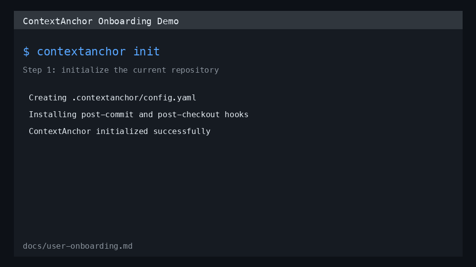

# ContextAnchor User Onboarding Guide

This guide takes a first-time user from zero setup to daily workflow usage.

## What You Will Complete

1. Install ContextAnchor CLI.
2. Connect a repository to your deployed API.
3. Capture your first context snapshot.
4. Restore context after switching branches.
5. Understand offline behavior and sync.

## Prerequisites

- Python 3.11+
- Git installed
- Access to deployed ContextAnchor API endpoint
- Valid API key tied to the API Gateway usage plan

## Step 1: Install The CLI

From the project root:

```bash
pip install -e ".[dev]"
contextanchor --help
```

Expected result: command list prints successfully.

## Step 2: Prepare API Credentials

Create local credentials file:

```bash
mkdir -p ~/.contextanchor
chmod 700 ~/.contextanchor
printf '%s' '<your-api-key>' > ~/.contextanchor/credentials
chmod 600 ~/.contextanchor/credentials
```

## Step 3: Initialize A Repository

In any Git repository where you want context tracking:

```bash
cd /path/to/your/repository
contextanchor init
```

This creates:

- `.contextanchor/config.yaml`
- Git hooks in `.git/hooks/post-commit` and `.git/hooks/post-checkout`

## Step 4: Configure API Endpoint

Edit `.contextanchor/config.yaml` in that repository:

```yaml
api_endpoint: "https://<api-id>.execute-api.<region>.amazonaws.com/prod/v1"
```

Optional fields you may also tune:

- `capture_prompt`
- `enabled_signals`
- `redact_patterns`
- `retention_days`

## Step 5: Capture Your First Context Snapshot

```bash
contextanchor save-context -m "Implementing auth middleware and tests"
```

Expected behavior:

- CLI gathers branch, diff, and recent commit signals.
- Secrets in intent text are redacted using configured regex patterns.
- Snapshot is sent to API and stored for your repository/branch.

If network is unavailable, ContextAnchor queues the operation locally and retries later.

## Step 6: View And Navigate Context

Show most recent context:

```bash
contextanchor show-context
```

List repository snapshots:

```bash
contextanchor list-contexts -l 10
```

View branch history:

```bash
contextanchor history -b main -l 10
```

View one snapshot by ID:

```bash
contextanchor show-context <snapshot_id> -f json
```

## Step 7: Branch Switch Restoration

When switching branches, the hook attempts restoration automatically:

```bash
git checkout feature/some-task
```

If hook execution is unavailable, run fallback manually:

```bash
contextanchor show-context
```

## Step 8: Offline And Sync Workflow

When offline:

1. `save-context` queues operations in `~/.contextanchor/local.db`.
2. `show-context` can fall back to cached snapshots.

When back online:

```bash
contextanchor sync
```

## Step 9: Export Metrics

Export metrics for workflow analysis:

```bash
contextanchor export-metrics -f json
contextanchor export-metrics -f csv
```

## Terminal Recording And GIF Walkthrough

Animated walkthrough:



Terminal transcript from a real onboarding run:

- [`docs/assets/onboarding-terminal-recording.txt`](assets/onboarding-terminal-recording.txt)

## FAQ

### 1) Do I need to run `contextanchor init` in every repository?

Yes. Initialization is repository-scoped and installs hooks/config in that specific repo.

### 2) Where does ContextAnchor store local state?

Under `~/.contextanchor/`:

- `credentials` for API key
- `local.db` for offline queue and cache
- `metrics.db` for instrumentation events
- `logs/contextanchor.log` for error logs

### 3) What happens when I am offline?

`save-context` queues operations locally with retry/backoff. Run `contextanchor sync` after connectivity returns.

### 4) Is source code uploaded to the API?

No. The system transmits metadata (repository ID, branch, file paths/status, line counts, commit metadata) and redacted developer intent.

### 5) How do I rotate API keys?

Follow the key rotation steps in `docs/production-readiness-checklist.md` and update `~/.contextanchor/credentials`.

### 6) Why is context not restoring on branch switch?

Usually hook permissions. Ensure both `.git/hooks/post-checkout` and `.git/hooks/post-commit` are executable.

### 7) Can I use ContextAnchor in multiple repositories?

Yes. Repository IDs are derived from remote URL and root path hash to avoid collisions.

### 8) How do I see all registered repositories locally?

Run:

```bash
contextanchor list-repositories
```

## Suggested First-Week Habit

Run `contextanchor save-context -m "<current intent>"` before you stop for breaks, standups, or task switches. This creates highly useful restoration points with minimal overhead.
